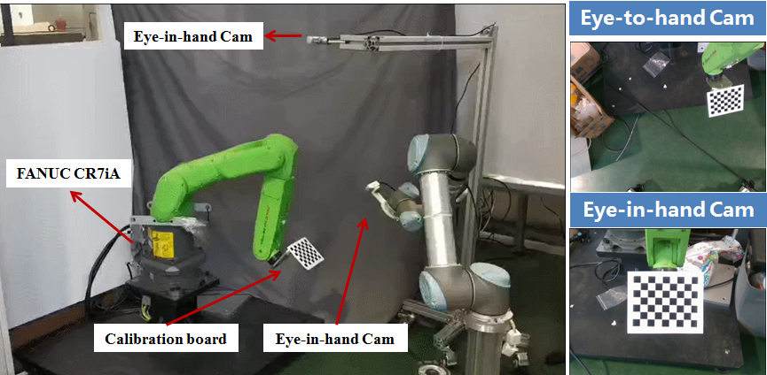

# realtime-robotic-grasping

## Overview

	

This repository is the supplementary materials of the paper "A Novel Camera Fusion Method based on Switching Scheme and object detection For Real Time Robotic Grasping."[Video](https://youtu.be/7_Y2SJP_AHY) by Liu et al. 
In this repo, we provide code about the use of ur5, Intel D435 for real-time robotic grasping and synthetic dataset generating.

## code review

* pose_estimation ： code for position based visual servoing.
* synthetic_dataset : code for automatic synthetic occlusion-aware dataset generating.
